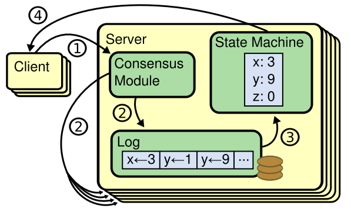
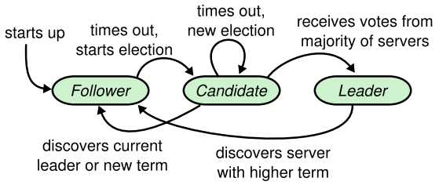
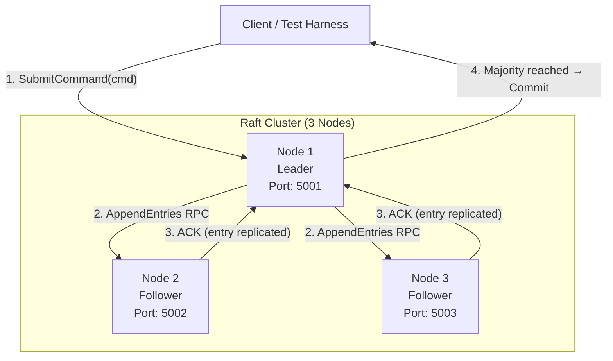
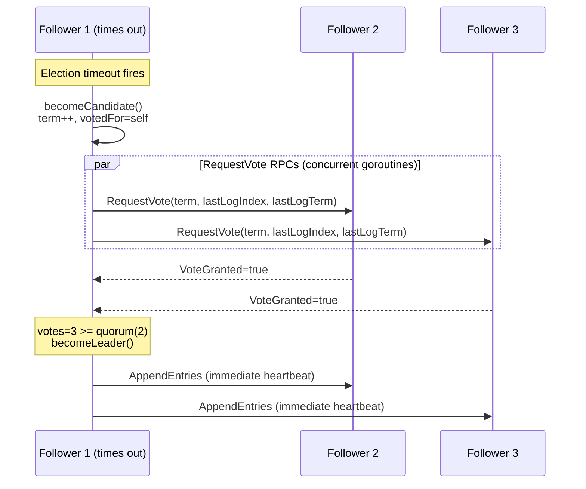
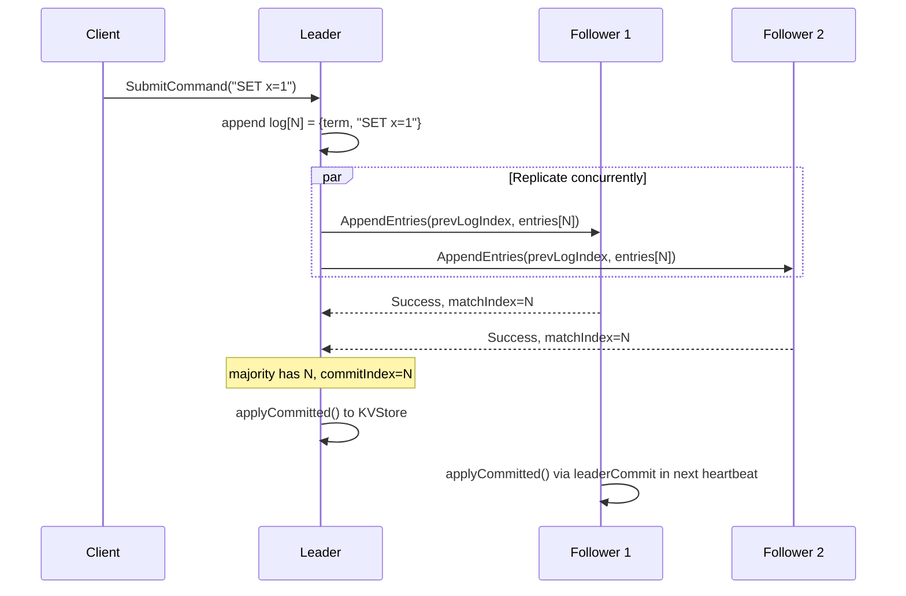
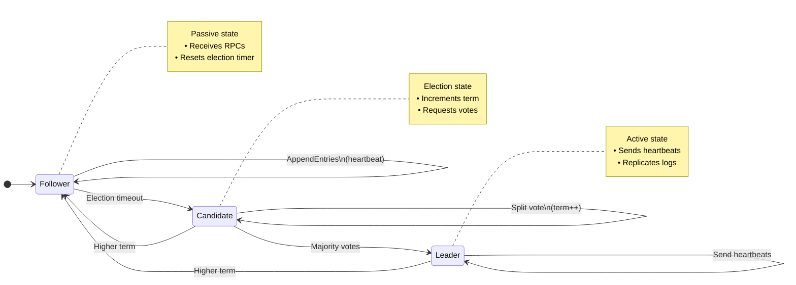

# MiniRaft

> A from-scratch implementation of the Raft distributed consensus algorithm in Go — engineered for correctness, concurrency safety, and production-grade observability.

MiniRaft is a complete, multi-node implementation of the [Raft consensus protocol](https://raft.github.io/raft.pdf) (Ongaro & Ousterhout, 2014). It achieves fault-tolerant, strongly consistent log replication across a cluster of nodes using only Go's standard library — no external frameworks, no shortcuts.

---

## Table of Contents

- [Motivation](#motivation)
- [Features](#features)
- [Architecture Overview](#architecture-overview)
- [Architecture Diagram](#architecture-diagram)
- [Project Structure](#project-structure)
- [Consensus Workflow](#consensus-workflow)
- [Concurrency Design](#concurrency-design)
- [Failure Scenarios Tested](#failure-scenarios-tested)
- [Testing](#testing)
- [Benchmarks](#benchmarks)
- [Observability & Dashboard](#observability--dashboard)
- [Key Engineering Challenges](#key-engineering-challenges)
- [Design Decisions](#design-decisions)
- [Current Limitations](#current-limitations)
- [Future Improvements](#future-improvements)
- [Learning Outcomes](#learning-outcomes)
- [Running the Project](#running-the-project)
- [References](#references)
- [Appendix](#appendix-resume-bullets-github-description--tags)

---

## Motivation

Distributed consensus is one of the hardest problems in systems engineering. Real-world systems like **etcd**, **CockroachDB**, and **Apache Kafka** depend on consensus protocols to guarantee correctness in the presence of arbitrary node failures and network partitions.

MiniRaft was built to:

- Deeply understand the Raft paper (§5.1–§5.4) by implementing every protocol detail from Figure 2 verbatim.!
- Explore the gap between "understanding" an algorithm and "correctly engineering" it under real concurrency constraints
- Practice the kind of systems design — goroutines, mutexes, deadlock prevention, atomics, RPC — that underpins production distributed infrastructure

The project deliberately avoids libraries for consensus, RPC encoding, or test orchestration, making every design decision explicit and visible in the code.

---

## Features

| Category | Feature |
|---|---|
| **Consensus** | Leader election with randomized timeouts (§5.2) |
| **Consensus** | Heartbeat mechanism — AppendEntries keepalives at 50ms intervals |
| **Consensus** | Full log replication with per-peer `nextIndex` / `matchIndex` tracking |
| **Consensus** | Majority quorum commit (only current-term entries directly committed, §5.4.2) |
| **Consensus** | Accelerated `nextIndex` backtracking via `ConflictTerm` / `ConflictIndex` hints |
| **Failure Recovery** | Leader crash detection and automatic re-election |
| **Failure Recovery** | Follower log repair — rejoining nodes catch up via AppendEntries retry loop |
| **Failure Recovery** | Stale leader step-down on higher-term observation (§5.1 universal rule) |
| **Failure Recovery** | Network partition handling — old leader demoted when partition heals |
| **Persistence** | Durable state persistence to disk (`currentTerm`, `votedFor`, `log`) |
| **Persistence** | Atomic write via temp-file + rename to prevent torn writes on crash |
| **Snapshots** | Log compaction with `InstallSnapshot` RPC for lagging peers (§7) |
| **Snapshots** | Threshold-triggered background snapshot creation (non-blocking) |
| **State Machine** | Thread-safe in-memory KV store (SET / GET / DELETE / INCR) |
| **RPC** | Concurrent RPC processing via Go's `net/rpc` over TCP |
| **RPC** | Lazy connection establishment and transparent reconnection on failure |
| **Concurrency** | `sync.RWMutex`-protected shared state; atomics for hot-path flags |
| **Observability** | Lock-free `atomic.Int64` metrics per node (elections, RPCs, heartbeats, commits) |
| **Observability** | Prometheus-compatible metrics endpoint (`/metrics/prometheus`) |
| **Observability** | Live web dashboard with cluster status, log inspection, and KV state |
| **Testing** | 20+ automated correctness tests across 7 categories |
| **Testing** | Go race detector validated (`go test -race`) |
| **Testing** | Performance benchmarks for election, replication, and crash recovery |

---

## Architecture Overview

### Node Architecture

Every node is a **replicated state machine** driven by a **replicated log**. The `Node` struct (in `node.go`) is the central data structure and encapsulates three categories of state drawn directly from Figure 2 of the Raft paper:

| State Category | Fields | Persistence |
|---|---|---|
| **Persistent** | `currentTerm`, `votedFor`, `log[]` | Saved to disk before every RPC response |
| **Volatile (all nodes)** | `commitIndex`, `lastApplied` | Rebuilt on restart |
| **Volatile (leader only)** | `nextIndex[]`, `matchIndex[]` | Re-initialized on every election win |

### RPC Communication

Nodes communicate using Go's built-in `net/rpc` library over **TCP**. There are three RPC types:

- **`RequestVote`** — sent by Candidates during elections
- **`AppendEntries`** — sent by Leaders for heartbeats (empty entries) and log replication (non-empty)
- **`InstallSnapshot`** — sent by Leaders to peers whose logs have been compacted

Connections are established **lazily** on first use and transparently re-established after failure. Holding the node mutex across any RPC is explicitly prohibited — this is the single most important invariant for deadlock prevention.

### State Management

All mutable state is protected by a single `sync.RWMutex`. The protocol follows a strict pattern:

```
acquire lock → snapshot state → release lock → network I/O → reacquire lock → process reply
```

After processing a reply, **stale-reply guards** validate that the node is still in the expected state/term before applying any changes.

### Node Roles



| Role | Behavior |
|---|---|
| **Follower** | Passive. Responds to RPCs. Times out → becomes Candidate |
| **Candidate** | Campaigns for leadership. Sends `RequestVote` to all peers |
| **Leader** | Accepts client commands. Replicates log. Sends heartbeats every 50ms |

---

## Architecture Diagram

### Cluster Communication



### Leader Election Flow



### Log Replication Flow



### Node State Machine




### Snapshot & Log Compaction

```mermaid
flowchart TD

    subgraph SnapshotCreation["Snapshot Creation"]
        A["Log size exceeds threshold"] --> B["checkSnapshotThreshold()"]
        B --> C["takeSnapshot(lastApplied)\n(background goroutine)"]
        C --> D["Serialize KV state\n(gob encoding)"]
        D --> E["Atomic snapshot write\n.tmp → snapshot"]
        E --> F["Compact log\n(keep sentinel entry)"]
        F --> G["Persist compacted state"]
    end

    subgraph SnapshotInstallation["Snapshot Installation"]
        H["Follower too far behind\nnextIndex ≤ log offset"] --> I["sendInstallSnapshot RPC"]
        I --> J["Follower installs snapshot"]
        J --> K["Restore KV state"]
        K --> L["Reset log + update indices"]
    end
```



---

## Project Structure

```
miniRaft/
├── frontend/                  # ⚛️ React/Vite Application (Modern Dashboard UI)
│   ├── src/                   # React components and UI hooks
│   ├── public/                # Static frontend assets
│   ├── package.json           # Node.js dependencies
│   ├── tsconfig.json          # TypeScript configuration
│   └── vite.config.ts         # Vite build configuration
├── static/                    # Legacy HTML/CSS/JS dashboard assets
├── data/                      # Persistent storage directory for Node state
│   ├── node-*.state           # Persistent state (currentTerm, votedFor, log)
│   └── node-*.snapshot        # Compressed snapshot state machine data
├── node.go                    # Core Node struct, state transitions, log helpers, RPC client mgmt
├── election.go                # RequestVote RPC handler + startElection() + runElectionTicker()
├── heartbeat.go               # sendHeartbeats(), heartbeatTicker(), sendHeartbeatToOne()
├── rpc.go                     # AppendEntries handler + SubmitCommand + replicateToFollower + advanceCommitIndex
├── snapshot.go                # Log compaction, takeSnapshot(), InstallSnapshot RPC, restoreSnapshot()
├── storage.go                 # Durable persistence: persist() + restore() via gob + atomic rename
├── state_machine.go           # KVStore: thread-safe SET / GET / DELETE / INCR operations
├── failure.go                 # Cluster test harness: NewCluster, Kill, Restart, WaitForLeader, WaitForCommit
├── main.go                    # Cluster bootstrap, live demo, failure scenario runner, web mode flag
├── dashboard.go               # HTTP dashboard: cluster status, node kill/restart, command submission
├── observability.go           # API types + GetLogSummary, GetSnapshotSummary, GetStateMachineSummary
├── metrics.go                 # Lock-free atomic metrics (elections, RPCs, heartbeats, commits)
├── prometheus.go              # Prometheus text-format metrics exporter (/metrics/prometheus)
├── utils.go                   # randomElectionTimeout(), minInt(), maxInt()
├── raft_test.go               # 20+ correctness tests across 7 categories
├── benchmark_test.go          # Performance benchmarks: election, replication, crash recovery
├── benchmark_resume_test.go   # Detailed, resume-worthy performance suite (Latency, Memory, Churn)
├── snapshot_test.go           # Snapshot creation, log compaction, InstallSnapshot tests
├── storage_test.go            # Persistence layer: persist/restore correctness
├── state_machine_test.go      # KVStore correctness tests
├── metrics_test.go            # Metrics counter accuracy tests
├── dashboard_test.go          # HTTP dashboard endpoint tests
├── prometheus_test.go         # Prometheus metric format tests
└── go.mod                     # Zero external dependencies (stdlib only)
```

### Key File Responsibilities

| File |  Responsibility |
|---|---|
| `node.go`  | Central data structure, state machine transitions, timer management, structured logging |
| `rpc.go`  | AppendEntries handler + full log replication loop with accelerated backtracking |
| `election.go`| RequestVote handler + concurrent vote fan-out + stale-reply prevention |
| `failure.go`  | Complete cluster simulation infrastructure — the backbone of the test suite |
| `heartbeat.go`  | Leader heartbeat goroutine with per-peer concurrent dispatch |
| `snapshot.go`  | Log compaction and snapshot transfer |

---

## Consensus Workflow

### 1. Leader Election

Every node starts as a **Follower** with an election timer set to a random value between **150–300ms**. If the timer fires without receiving a valid heartbeat:

1. The node calls `becomeCandidate()`: atomically increments `currentTerm`, sets `votedFor = self`, transitions to Candidate
2. `startElection()` snapshots the current state under the mutex, then releases it
3. One goroutine per peer sends a `RequestVote` RPC concurrently
4. Each goroutine reacquires the lock upon reply and applies two stale-reply guards:
   - **State guard**: `n.state == Candidate` (may have already stepped down)
   - **Term guard**: `n.currentTerm == termAtStart` (may have seen a higher term)
5. On majority (`votes >= ceil((N+1)/2)`), `becomeLeader()` runs under the lock. Subsequent goroutines see `state != Candidate` and exit — **no double-promotion is possible**

**Vote Grant Conditions (all must hold):**
- `args.Term >= n.currentTerm`
- `n.votedFor == -1 || n.votedFor == args.CandidateID`
- Candidate's `(lastLogTerm, lastLogIndex)` is at least as up-to-date as voter's (**Election Restriction §5.4.1**)

### 2. Log Replication

When a client submits a command:

1. `SubmitCommand()` appends the entry to the leader's log under the mutex (atomically assigns index and term)
2. `replicateToFollowers()` fans out one goroutine per peer immediately — **no waiting for the next heartbeat tick**
3. Each `replicateToFollower()` goroutine runs a retry loop:
   - Builds `AppendEntriesArgs` with `prevLogIndex`, `prevLogTerm`, and all entries from `nextIndex[peer]` onward
   - Sends the RPC (lock released)
   - On rejection: applies **accelerated backtracking** using `ConflictTerm` / `ConflictIndex` hints — resolves in O(distinct terms) round trips rather than O(N)
   - On success: updates `matchIndex[peer]` (using `max()` to prevent race regression) and calls `advanceCommitIndex()`

### 3. Commit Process

`advanceCommitIndex()` scans from `lastLogIndex` downward to find the highest index `N` satisfying:

```
N > commitIndex
AND log[N].Term == currentTerm       // §5.4.2: only commit current-term entries directly
AND majority of peers have matchIndex[peer] >= N
```

> **Why only current-term entries?** The "Figure 8 scenario" from the Raft paper demonstrates that directly committing an old-term entry can create a contradiction — a future leader could legally overwrite it. Only committing current-term entries, which transitively commit all prior entries via the Log Matching Property, preserves safety.

### 4. Failure Recovery

On a leader crash:

1. Followers stop receiving heartbeats; their election timers fire after 150–300ms
2. The first follower to time out campaigns. Others receive `RequestVote` and grant votes only if the candidate's log is at least as up-to-date as theirs (Election Restriction)
3. The new leader initializes `nextIndex[peer] = lastLogIndex + 1` for all peers (optimistic)
4. On first `AppendEntries` rejection from a behind peer, the retry loop uses conflict hints to jump `nextIndex` — log repair completes in O(conflicting terms) round trips

---

## Concurrency Design

### Why Goroutines?

Raft requires **concurrent** communication with all peers simultaneously:

- One goroutine per peer during elections (`startElection`)
- One goroutine per peer for heartbeats (`heartbeatTicker`)
- One goroutine per peer for log replication (`replicateToFollowers`)
- One long-lived goroutine for the election ticker (`runElectionTicker`)
- One long-lived goroutine for the heartbeat ticker (`sendHeartbeats`)
- One background goroutine per snapshot creation (`takeSnapshot`)

If these were serialized, a slow or crashed peer would block all others — destroying the liveness guarantee.

### Why a Mutex?

The `Node` struct has shared mutable state (`currentTerm`, `log`, `commitIndex`, `state`, etc.) that is accessed by multiple goroutines. A `sync.RWMutex` is used:

- **Read lock** (`RLock`): multiple goroutines reading state concurrently (e.g., building RPC args)
- **Write lock** (`Lock`): exclusive state mutation (term changes, log appends, state transitions)

### Shared State Protection

| State | Lock Required | Notes |
|---|---|---|
| `currentTerm`, `votedFor`, `log[]` | Write lock | Persistent; must also be durably saved |
| `commitIndex`, `lastApplied` | Write lock | Monotonically increasing |
| `nextIndex[]`, `matchIndex[]` | Write lock | Leader-only; matchIndex update uses `max()` for race safety |
| `state` | Write lock | Only 3 values; transitions enforced via `becomeXxx()` helpers |
| `dead` | `atomic.Int32` | Checked in hot paths without taking the mutex |
| `metrics.*` | `atomic.Int64` | All lock-free; no mutex required |

### Race Conditions Prevented

| Bug Class | Prevention |
|---|---|
| **Deadlock from RPC under lock** | Enforced by explicit rule: snapshot state → release → RPC → reacquire |
| **Stale reply processed in new term** | Double guard: `state == Candidate/Leader` AND `currentTerm == termAtStart` |
| **Double leader promotion** | `becomeLeader()` sets `state=Leader`; guards see `state != Candidate` and exit |
| **Loop variable capture** | All goroutine closures pass `peerID` as a function argument, not a closure capture |
| **matchIndex regression under concurrent replies** | `max(newMatch, currentMatch)` on every success reply |
| **Timer spurious fire after reset** | Correct Stop + non-blocking drain + Reset pattern on all timers |
| **Stale heartbeat goroutine after step-down** | `termWon` captured at election time; goroutine exits when `currentTerm != termWon` |

---

## Failure Scenarios Tested

The following failure scenarios are implemented in `failure.go` and exercised as automated tests and interactive demos:

| Scenario | Description | Raft Property Verified |
|---|---|---|
| **Scenario 1: Leader Crash** | Current leader is killed; remaining 2 nodes elect a new leader | Liveness — cluster recovers from f=1 failure with N=3 |
| **Scenario 2: Old Leader Rejoin** | Killed leader restarts; new cluster has higher term; old node steps down to Follower | Higher-Term Rule §5.1 — stale leader cannot persist |
| **Scenario 3: Partial Replication** | One follower killed; entries committed on leader + 1 follower = quorum; killed follower restarts and must NOT win election | Election Restriction §5.4.1 — stale log cannot win |
| **Scenario 4: Network Partition** | Leader is isolated; remaining peers elect new leader; old leader rejoins and sees higher term | Partition safety — isolated leader demoted on heal |

---

## Testing

### Test Suite Summary

```bash
# Run all tests
go test -v -timeout 120s ./...

# Run with race detector (required for correctness claims)
go test -race -v -timeout 120s ./...

# Run a specific test
go test -v -run TestLeaderCrash .
```

### Correctness Tests (20+ tests across 7 categories)

#### Basic Correctness

| Test | What It Verifies |
|---|---|
| `TestInitialElection` | Exactly one leader elected on startup; leader stable across 600ms |
| `TestLeaderStability` | No spurious re-elections for 1 second (20 heartbeat intervals) |
| `TestHigherTermElection` | Node with higher term wins election |

#### Log Replication

| Test | What It Verifies |
|---|---|
| `TestBasicReplication` | Single command replicated to all 3 nodes |
| `TestReplicationOrdering` | 5 sequential commands applied in submission order on all nodes |
| `TestConcurrentSubmit` | 10 simultaneous concurrent commands all committed without corruption |
| `TestLargeLog` | 50 sequential commands; all nodes have identical logs |

#### Leader Failure

| Test | What It Verifies |
|---|---|
| `TestLeaderCrash` | New leader elected at higher term after crash |
| `TestCommittedEntryPreserved` | Committed entry survives leader crash (State Machine Safety §5.4.3) |
| `TestMultipleLeaderCrashes` | 3 consecutive leader crashes on 5-node cluster; cluster remains operational |

#### Log Repair

| Test | What It Verifies |
|---|---|
| `TestFollowerLogRepair` | Follower offline during 5 commits catches up within 3s after rejoin |
| `TestOldLeaderRejoin` | Restarted ex-leader becomes Follower; exactly one leader remains |
| `TestPartialReplication` | Committed entry on majority survives minority-follower crash + leader crash |

#### Quorum & Safety

| Test | What It Verifies |
|---|---|
| `TestNoQuorumNoCommit` | With 1-of-3 nodes, entry appended to log but never committed |
| `TestElectionRestriction` | Stale node cannot win election against node with newer log |
| `TestOneLeaderPerTerm` | Across 4 elections, no two leaders ever share the same term |

#### Concurrency

| Test | What It Verifies |
|---|---|
| `TestRaceCondition` | Concurrent submit + 3 leader crashes produce no data races under `-race` |

#### Integration

| Test | What It Verifies |
|---|---|
| `TestAllScenarios` | All 4 failure scenarios pass end-to-end |

### Snapshot Tests

- `TestSnapshotCreation` — snapshot taken after threshold; log compacted
- `TestSnapshotPersistence` — snapshot survives node restart
- `TestInstallSnapshot` — lagging peer receives and applies snapshot
- `TestSnapshotAndReplication` — commands after snapshot correctly replicated

### Safety Guarantees Verified

| Guarantee | Test |
|---|---|
| **Election Safety**: ≤1 leader per term | `TestOneLeaderPerTerm`, `assertExactlyOneLeader` |
| **Log Matching**: identical logs across nodes | `assertLogsMatch`, `TestReplicationOrdering` |
| **Leader Completeness**: new leader has all committed entries | `TestCommittedEntryPreserved`, `TestPartialReplication` |
| **State Machine Safety**: committed entries never lost | `TestCommittedEntryPreserved`, `TestElectionRestriction` |
| **Thread Safety**: no data races | `TestRaceCondition` + `-race` flag |

---

## Benchmarks

```bash
go test -bench=. -benchtime=5s ./...
```

| Benchmark | Description |
|---|---|
| `BenchmarkLeaderElection/3_Nodes` | End-to-end election time from cluster start on 3 nodes |
| `BenchmarkLeaderElection/5_Nodes` | End-to-end election time on 5 nodes |
| `BenchmarkLogReplication/3_Nodes` | Single command round-trip (submit to commit) latency |
| `BenchmarkConcurrentCommands/3_Nodes` | Parallel command throughput |
| `BenchmarkHeartbeatThroughput` | Background heartbeat rate under observation load |
| `BenchmarkCrashRecovery/3_Nodes` | Time from leader crash to new leader elected |


Detailed benchmack is done in [BENCHMARKS.md](BENCHMARKS.md)
---

## Observability & Dashboard

### Live Web Dashboard (React/Vite)

The repository includes a modern, full-stack frontend built with React, Vite, and TypeScript to visualize the Raft cluster in real time.

```bash
# Terminal 1: Start the Go backend API
go run . --web

# Terminal 2: Run the React frontend
cd frontend
npm install
npm run dev
# Open: http://localhost:5173
```

The dashboard exposes:
- **Cluster status** — leader ID, current term, per-node state
- **Log viewer** — per-node log entries with committed/pending status
- **Snapshot viewer** — compaction offset and physical log size
- **KV state machine** — current key-value store contents per node
- **Interactive controls** — kill / restart any node, simulate network partitions, and submit commands in real time
#### Basic view of Nodes


```bash
go run . --web
# Open: http://localhost:8080
```

### Prometheus Metrics

```bash
curl http://localhost:8080/metrics/prometheus
```

Exported metrics per node (with `node="N"` label):

| Metric | Description |
|---|---|
| `mini_raft_current_term` | Logical clock (monotonically increasing) |
| `mini_raft_state` | 0=Follower, 1=Leader, 2=Candidate |
| `mini_raft_elections_won` | Times this node became leader |
| `mini_raft_elections_lost` | Failed candidacies (split votes) |
| `mini_raft_rpc_sent` | Total RPCs dispatched |
| `mini_raft_rpc_received` | Total RPCs handled |
| `mini_raft_heartbeats_sent` | Leader heartbeat dispatches |
| `mini_raft_heartbeats_received` | Heartbeats acknowledged by follower |
| `mini_raft_commands_committed` | Entries advanced past `commitIndex` |
| `mini_raft_commands_applied` | Entries applied to the KV state machine |
| `mini_raft_commit_index` | Highest durably committed log index |
| `mini_raft_log_length` | Physical entries in log (after compaction) |

---

## Key Engineering Challenges

### 1. The Deadlock Triangle: Mutex + RPC + Timer

The most dangerous invariant in this codebase: **the mutex must never be held across a network call**. An RPC call blocks on the network. If the mutex is held, the RPC server goroutine (handling an incoming call on the same node) tries to acquire the same mutex — deadlock.

**Solution**: Every goroutine that makes an RPC follows the pattern: snapshot needed state under lock → unlock → RPC → relock → validate reply is not stale. This pattern is enforced consistently across `election.go`, `heartbeat.go`, and `rpc.go`.

### 2. Stale Reply Processing

In a concurrent system, a goroutine that sent an RPC may receive a reply long after the node's state has changed. Processing a stale reply can cause a Candidate to become Leader in the wrong term, or a step-down to happen incorrectly.

**Solution**: Every reply handler applies two guards before processing: (1) verify `n.state` is still the expected role, and (2) verify `n.currentTerm == termAtStart` (term captured at the time of the RPC call). If either fails, the reply is silently discarded.

### 3. The Figure 8 Scenario — Why Only Current-Term Entries Are Directly Committed

A subtle but critical safety requirement: a leader may not directly commit entries from previous terms, even if a majority acknowledges them. Doing so can create an irrecoverable inconsistency (two leaders both believing different entries are committed at the same index).

**Solution**: `advanceCommitIndex()` checks `log[N].Term == currentTerm` before advancing `commitIndex`. Old-term entries are committed indirectly — as a side effect of committing a current-term entry at a higher index, the Log Matching Property transitively commits all prior entries.

### 4. Accelerated nextIndex Backtracking

Naive log repair decrements `nextIndex` by 1 per round trip — O(N) RPCs to synchronize a follower N entries behind.

**Solution**: The `AppendEntriesReply` struct includes `ConflictTerm` and `ConflictIndex`. When a follower rejects an `AppendEntries`, it includes the term of the conflicting entry and the first index with that term. The leader uses these hints to jump `nextIndex` to the start of the conflicting term in a single step, reducing synchronization to O(distinct conflicting terms).

### 5. Safe Timer Reset in Go

Go's `time.Timer` has a subtle API pitfall: if `Stop()` returns `false`, the timer has already fired and the value is sitting in the channel. Calling `Reset()` without draining the channel first causes a spurious fire.

**Solution**: Every timer reset follows the canonical three-step pattern: `Stop()` → non-blocking `drain` → `Reset(newDuration)`. This is implemented in `resetElectionTimer()` and applied consistently across the codebase.

### 6. Double Promotion Prevention

When a Candidate sends `RequestVote` to N peers concurrently, multiple goroutines may independently see the majority threshold crossed and attempt to call `becomeLeader()`.

**Solution**: `becomeLeader()` sets `n.state = Leader`. Subsequent goroutines that reach the quorum check see `n.state != Candidate` (via the stale-reply Guard A) and exit immediately. No `sync.Once` or additional atomic is needed — the existing mutex makes the state transition visible atomically to all goroutines.

---

## Design Decisions

### Single `sync.RWMutex` vs. Fine-Grained Locks

**Decision**: One mutex for all node state.

**Rationale**: Raft's state transitions are deeply coupled (e.g., `currentTerm` changes trigger `state` changes and `votedFor` resets). Fine-grained locking would require careful ordering to prevent deadlock. A single lock simplifies reasoning — if you hold the lock, you have a consistent snapshot of the entire node state. Read locks allow concurrent RPC arg construction without blocking one another.

### Go's `net/rpc` vs. gRPC

**Decision**: Standard library `net/rpc` over TCP.

**Rationale**: Zero external dependencies. `net/rpc` uses gob encoding and provides blocking call semantics that match the Raft protocol naturally. gRPC's additional complexity (protobuf schemas, code generation, HTTP/2) would obscure the consensus logic.

### Immediate Replication vs. Heartbeat Piggybacking

**Decision**: `SubmitCommand()` triggers immediate replication (`go replicateToFollowers()`), separate from the 50ms heartbeat.

**Rationale**: If replication only happened at heartbeat time, commit latency would be up to 50ms + 1 RTT. Immediate fan-out reduces commit latency to ~1 RTT. Heartbeats continue to serve as keepalives and as a fallback replication path for lagging peers.

### Atomic `dead` Flag vs. Mutex-Protected Bool

**Decision**: `atomic.Int32` for the `isDead()` check.

**Rationale**: `isDead()` is called at the top of every hot loop. Acquiring a mutex on each call would serialize all goroutines. An atomic load is a single CPU instruction and is safe for this single-writer, multi-reader pattern.

### Sentinel Log Entry at Index 0

**Decision**: Initialize every node's log with a dummy `LogEntry{Index:0, Term:0}` at position 0.

**Rationale**: Eliminates boundary condition handling for the very first `AppendEntries`. When `prevLogIndex=0` and `prevLogTerm=0`, the sentinel always matches, so the consistency check passes without special-casing. This reduces code complexity and bug surface in the `AppendEntries` handler.

---

## Current Limitations

| Limitation | Notes |
|---|---|
| **In-memory log after compaction** | The physical log in RAM grows until a snapshot is taken; the snapshot itself is on disk |
| **Fixed cluster size** | The peer map is set at startup; dynamic membership changes (§6) are not implemented |
| **No linearizable reads** | GET commands go through the log like writes; `ReadIndex` or lease-based reads are not implemented |
| **No client retry / redirection** | Tests submit directly to the leader; a real client would need to detect non-leaders and retry |
| **Single-process simulation** | All nodes run in the same OS process; actual network failures are not simulated |
| **gob encoding** | The RPC and persistence layers use Go's `encoding/gob`, which is not cross-language compatible |
| **No pipelining** | Each `replicateToFollower` loop waits for a reply before sending the next batch |

---

## Future Improvements

- [ ] **Joint consensus membership changes** — add/remove nodes without cluster downtime (Raft §6)
- [ ] **ReadIndex optimization** — leader confirms its authority before serving reads, avoiding log round trips
- [ ] **Log pipelining** — send multiple AppendEntries in flight without waiting for each ACK
- [ ] **Pre-vote extension** — candidates check viability before incrementing term to reduce spurious elections
- [ ] **Follower lease reads** — bounded-staleness reads from followers using leader lease duration
- [ ] **Prometheus + Grafana integration** — dashboards for `commitIndex` lag, election rate, RPC latency histograms
- [ ] **Chaos testing** — inject random delays, packet drops, and clock skew using a proxy layer
- [ ] **Multi-Raft** — shard state across multiple independent Raft groups (as in TiKV / CockroachDB)

---

## Learning Outcomes

Building MiniRaft from scratch produced concrete engineering skills:

- **Distributed Systems**: Deep understanding of consensus — quorum, safety vs. liveness tradeoffs, the Figure 8 scenario, why leader completeness requires the election restriction
- **Concurrent Programming**: Production-quality mutex discipline, goroutine lifecycle management, avoiding deadlock through architectural rules rather than ad-hoc workarounds
- **Go Internals**: `sync.RWMutex` semantics, `sync/atomic` guarantees, `net/rpc` over TCP, `encoding/gob`, safe `time.Timer` reset patterns, goroutine leak prevention
- **Systems Resilience**: Atomic writes with temp-file + rename to prevent torn state, idempotent RPC design, reconnection without explicit retry loops
- **Test Engineering**: Infrastructure-driven testing (the `Cluster` harness), property-based assertions (Election Safety, Log Matching, State Machine Safety), race detector integration

---

## Running the Project

### Prerequisites

- Go 1.22+

### Demo Mode

```bash
go run .
```

Bootstraps a 3-node cluster, submits 5 commands, and runs all 4 failure scenarios with detailed protocol-trace logs.

### Web Dashboard Mode

```bash
go run . --web
# Visit http://localhost:8080
```

### Tests

```bash
# All tests
go test -v -timeout 120s ./...

# With race detector
go test -race -v -timeout 120s ./...

# Single test
go test -v -run TestLeaderCrash ./...

# Benchmarks
go test -bench=. -benchtime=5s ./...
```

---

## References

- **Raft Paper**: [In Search of an Understandable Consensus Algorithm](https://raft.github.io/raft.pdf) — Ongaro & Ousterhout, USENIX ATC 2014
- **Raft Visualization**: [raft.github.io](https://raft.github.io/) — Interactive step-through of leader election and log replication
- **Extended Raft Thesis**: [Ongaro PhD Dissertation](https://github.com/ongardie/dissertation/blob/master/stanford.pdf) — Detailed treatment of membership changes, snapshotting, and client interaction
- **MIT 6.5840 Lab 3**: The test structure and scenario design in this project is inspired by the MIT Distributed Systems course labs

---


